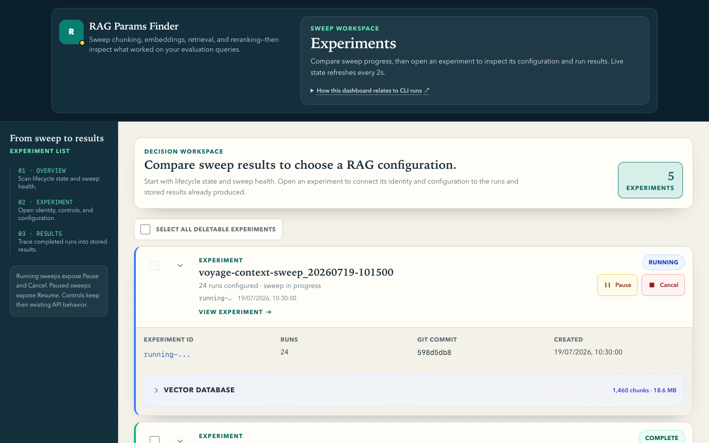
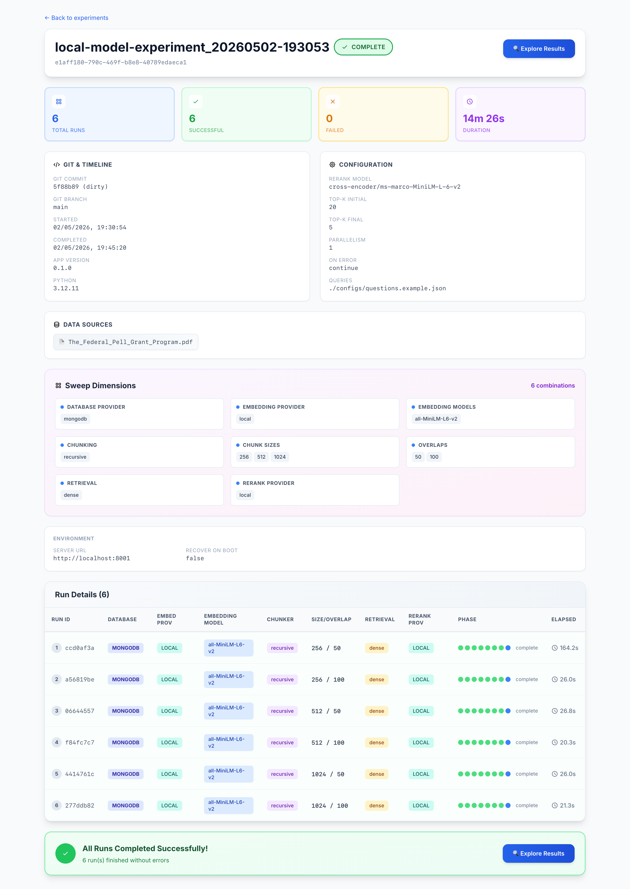
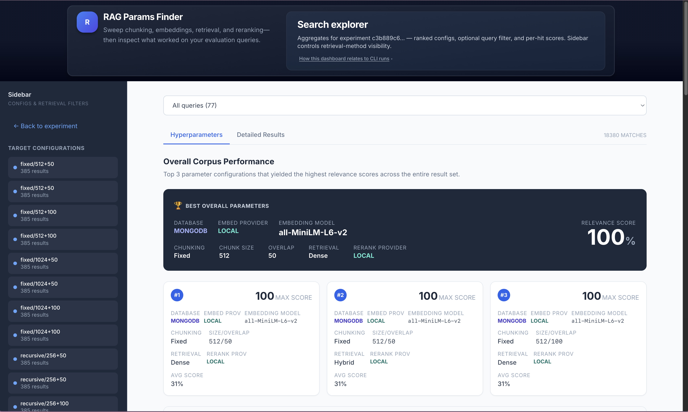

# rag-params-finder

> Find your optimal RAG configuration — **before** you build your RAG application.

**RAG parameter sweep experimentation tool** — systematically evaluate embedding models, chunking strategies, and retrieval methods using MongoDB Atlas Vector Search. Supports **Voyage AI** (hosted), **local sentence-transformers** (no API key), and **SIE** open-source embeddings (BGE-M3, Stella-v5, SPLADE-v3 — opt-in Docker).

Most RAG projects start with a guess: pick an embedding model, pick a chunking method, a retrieval method (or a re-ranker), realise it's wrong, refactor. That loop is
slow and expensive.

`rag-params-finder` inverts it.

Give it your data and your questions. It runs every combination — embedding
model × chunking method × retrieval method — stores the retrieval scores and
shows you exactly which configuration performs best.
**Before you write a single line of your RAG application.**

**Jump to:** [Quickstart](QUICKSTART.md) | [Who is this for?](#who-is-this-for) | [Screenshots](#-screenshots) | [Key Features](#-key-features) | [Documentation](docs/README.md) | [Contributing](#-contributing)

## Why this matters

| What you avoid | What you get instead |
|---|---|
| No LLM calls | Embedding only — 10–100× cheaper |
| No eval framework setup | One YAML config, one CLI command |
| No deployed RAG app needed | Just your data, your questions, your credentials |
| No guessing | Actual retrieval scores across every config, side by side |
| No throwaway experiments | Results persist — compare runs across sessions |

## What it sweeps

- **Embedding models**: 13 Voyage models (voyage-4 series, domain, context, voyage-3 legacy) — see `server/core/model_registry.py`
- **Chunking methods**: Fixed · Recursive · Token · Sentence · Semantic
- **Retrieval methods**: Dense · Sparse · Hybrid
- **Questions**: Persona-organised — user provided or generated as part of golden master generation process

One YAML. N experiments. Evidence-based decision. Ship the right config first.

## Who is this for?

> Pick the row that matches you — each links to a **first step**, not the whole README.

| Persona | Start here | What you will do |
|---------|------------|------------------|
| **New user — cloud accounts** | [Cloud Account Setup](docs/user-guide/cloud-setup.md) | Atlas + optional Voyage, then [QUICKSTART](QUICKSTART.md) |
| **New user — first sweep** | [QUICKSTART](QUICKSTART.md) | Install, run server + CLI, open dashboard |
| **Operator — config & CLI** | [Configuration Reference](docs/user-guide/configuration.md) | YAML sweeps, env vars, `rag-params-finder` commands |
| **Operator — dashboard** | [Dashboard Guide](docs/user-guide/dashboard-guide.md) | Live phases, Search Explorer, experiment controls |
| **Operator — fixing errors** | [Troubleshooting](docs/user-guide/troubleshooting.md) | Indexes, Voyage limits, Docker, storage quota |
| **Contributor — system design** | [Architecture](docs/contributor-guide/architecture.md) | Modules, data flow, ADRs |
| **Contributor — dev setup** | [Development Guide](docs/contributor-guide/development.md) | Quality gates, slices, Docker, hooks |
| **Agent / slice worker** | [AGENTS.md](AGENTS.md) · [CLAUDE.md](CLAUDE.md) | [PROGRESS](docs/slices/PROGRESS.md) → current slice spec |

**All docs by topic:** [docs/README.md](docs/README.md)

---

## 📸 Screenshots

| Screen | Description |
|:---:|:---|
|  | **Experiments list** — all submitted sweeps with status badges and run counts |
|  | **Experiment detail** — metric cards, live phase indicator dots, runs table |
|  | **Search Explorer** — best-parameters card, ranked configs with score bars |

---

## 🚀 Quick Start

See **[QUICKSTART.md](QUICKSTART.md)** for install, `.env`, server, dashboard, and first sweep commands (including optional Docker).

---

## 🗺️ Choose Your Path

| I want to… | Start here |
|---|---|
| Set up MongoDB Atlas or Voyage AI accounts | [Cloud Account Setup](docs/user-guide/cloud-setup.md) |
| Run my first experiment | [Getting Started](docs/user-guide/getting-started.md) |
| Understand all config options | [Configuration Reference](docs/user-guide/configuration.md) |
| Learn all CLI commands | [CLI Reference](docs/user-guide/cli-reference.md) |
| Understand the dashboard | [Dashboard Guide](docs/user-guide/dashboard-guide.md) |
| Fix an error | [Troubleshooting](docs/user-guide/troubleshooting.md) |
| Understand the system design | [Architecture](docs/contributor-guide/architecture.md) |
| Add a new model, chunker, or endpoint | [Extending the System](docs/contributor-guide/extending.md) |
| Set up a development environment | [Development Guide](docs/contributor-guide/development.md) |
| Why these design choices? | [ADR-001](docs/adr/ADR-001-two-process-architecture.md) · [ADR-002](docs/adr/ADR-002-voyage-and-local-providers.md) · [ADR-003](docs/adr/ADR-003-mongodb-atlas-vector-store.md) |

---

## ⚡ Key Features

### 🎯 **NEW in v0.11.0**: Weighted Averaging & Tiebreaker Explanations
- **Weighted averaging** (query-level fairness): Each query contributes equally, preventing queries with many results from dominating the average — configurable via `TIEBREAKER_METRIC` env var ([docs](docs/user-guide/configuration.md#%EF%B8%8F-environment-variables-env))
- **Tiebreaker explanation UI**: When multiple configs achieve 100% max score, the dashboard shows amber alerts, explanation panels, visual badges (⭐ "Best by tiebreaker", 🔀 "Tied"), and contextual annotations explaining WHY each config is ranked
- **Detailed Results ↔ Hyperparameters mapping**: Chunk size/overlap badges, query text display, and explanatory headers help users map individual results back to aggregated configs
- **Collapsible sweep dimensions panel**: Shows unique values for all swept parameters + Cartesian product calculation ([dashboard guide](docs/user-guide/dashboard-guide.md#-search-explorer))

### Core Features
- **5 chunking methods**: Fixed, Recursive, Token, Sentence, Semantic
- **3 retrieval methods**: Dense (vector search), Sparse (BM25), Hybrid (Reciprocal Rank Fusion)
- **Voyage AI models**: all registered embeddings in `model_registry.py` (voyage-4/3/domain/context) + rerankers `rerank-2.5-lite`, `rerank-2.5`, and legacy rerank APIs
- **Local models** (no API key): `all-MiniLM-L6-v2` + `cross-encoder/ms-marco-MiniLM-L-6-v2`
- **Multi-format data loading**: PDF, TXT, Markdown, CSV — files or directories
- **Cartesian sweep**: one YAML config → N models × M methods × P sizes × Q overlaps runs
- **Live phase tracking**: QUEUED → PARSING → CHUNKING → EMBEDDING → STORING → QUERYING → RERANKING → COMPLETE
- **Experiment management**: Pause/resume long sweeps, cancel running experiments, delete with cascade cleanup, boot orphan reconciliation
- **Search index preflight**: Validates required Atlas Search indexes and cluster quota before sweeps start; rejects with HTTP 422 when indexes are missing or quota exhausted
- **Atlas index CLI**: `indexes list` and `indexes reset` for M0 quota troubleshooting
- **Vector DB stats**: Cluster and per-experiment chunk/storage estimates; optional Atlas quota bar with tier, provider, and region when Admin API credentials are configured
- **Progress feedback**: Byte-level network loading, circular progress with elapsed time and ETA, background polling with "Syncing..." badges
- **Scoped logging**: Server and dashboard use `[rag-params-finder] [Scope] operation — details` format; set `LOG_LEVEL=DEBUG` for verbose server output
- **Pagination**: All list views paginated (10 items per page for experiments/runs, 5 for configs); collapsible experiment rows

---

## 🧱 Built With

**Backend**: FastAPI · Python 3.12 · Pydantic · PyMongo · LangChain text splitters · pypdf · Typer · Rich · sentence-transformers · NLTK · tiktoken

**Frontend**: React 19 · TypeScript 5.8 · Vite 6 · Tailwind CSS

**AI/ML**: Voyage AI · sentence-transformers · SIE (Superlinked Inference Engine) · MongoDB Atlas Vector Search

**Dev tools**: uv · ruff · mypy · pytest · GitHub Actions

---

## 📦 Releases & Versioning

This project follows [Semantic Versioning](https://semver.org/):
- **MAJOR** (x.0.0) — Breaking changes
- **MINOR** (0.x.0) — New features, completed slices (backward compatible)
- **PATCH** (0.0.x) — Bug fixes, polish, enhancements

**Current version:** v0.11.0 ([CHANGELOG.md](CHANGELOG.md))

**Release history:** [15 releases on GitHub](https://github.com/neomatrix369/rag-params-finder/releases) documenting development from v0.0.1 (initial skeleton) through v0.11.0 (weighted averaging)

**For contributors:** See [Release Process](docs/contributor-guide/release-process.md) for how to create new releases

---

## 🤝 Contributing

Contributions welcome — please open an issue first to discuss the change.

**Running experiments does not require any extra tooling** — the [user guide](docs/user-guide/getting-started.md) path (Atlas, CLI, optional dashboard) is enough.

**Contributors** use the [Development Guide](docs/contributor-guide/development.md) for setup (`bash scripts/install-git-hooks.sh` — checks on commit and push), quality gates (`./scripts/quality-gates.sh`), the slice workflow, and [release cadence](docs/contributor-guide/release-process.md#when-to-release) (release when a slice or feature is user-visible; see [CHANGELOG](CHANGELOG.md) `Unreleased` during development).

Optional **AI-assisted development** (Cursor / Claude Code with the `code-review-graph` knowledge graph) is documented in the development guide — it helps navigate this repo faster; it is not part of the RAG sweep runtime.

Priority areas: test suite with mock MongoDB fixtures, Search Explorer dashboard enhancements, SSE live updates.

**Agent entry points:** [AGENTS.md](AGENTS.md) · [CLAUDE.md](CLAUDE.md)

---

## 📄 License

MIT — see [LICENSE](LICENSE)

---

## 🙏 Credits

Inspired by [pre-rag-explorer-dashboard](https://github.com/neomatrix369/pre-rag-explorer-dashboard).
