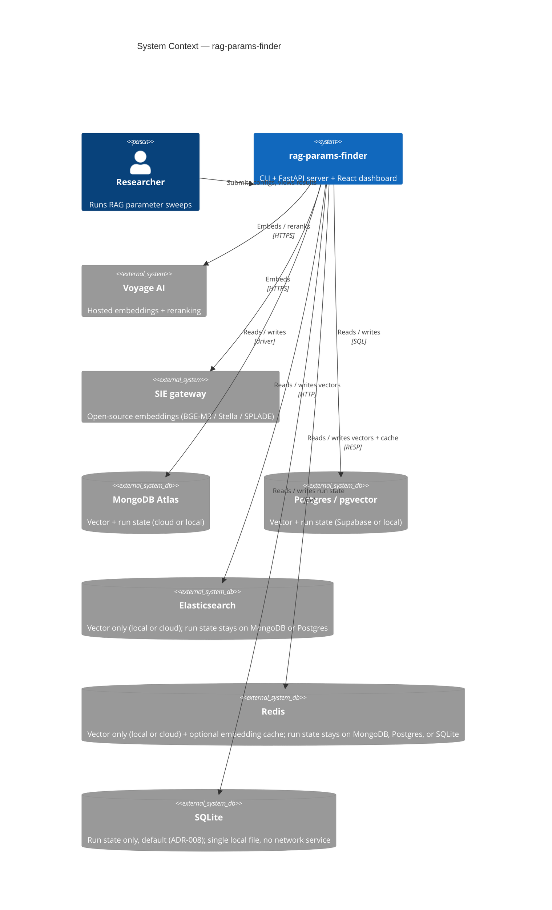
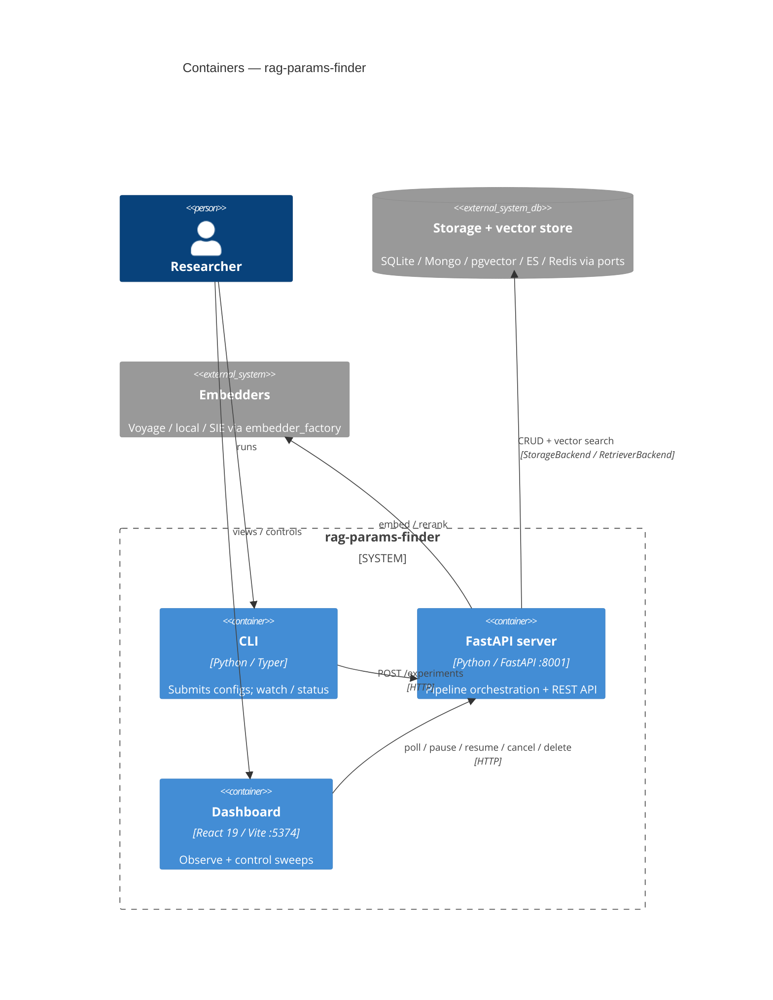
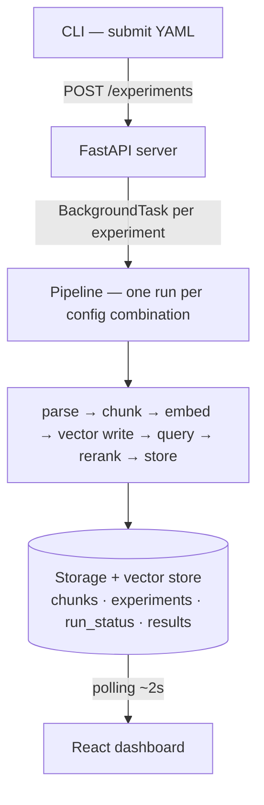
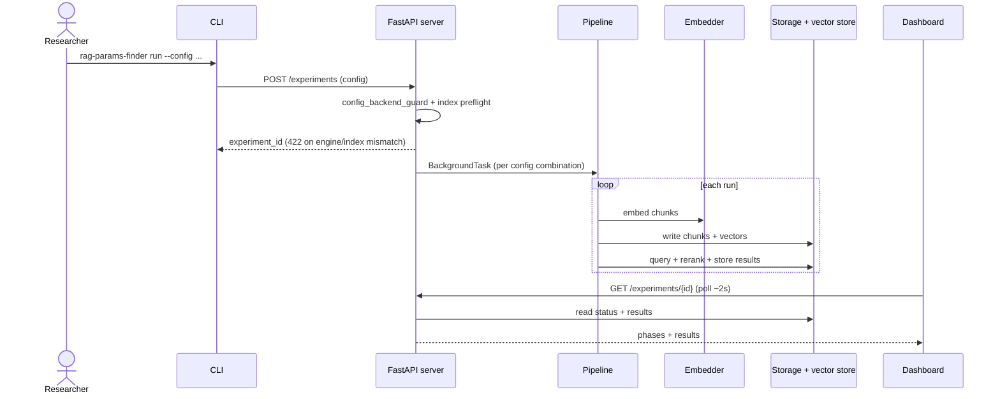
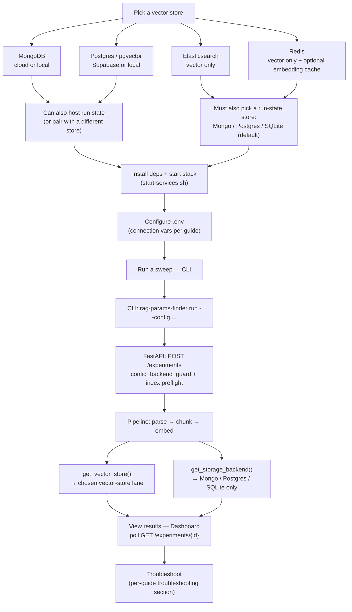
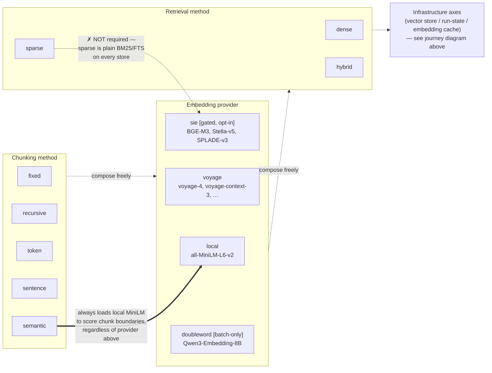
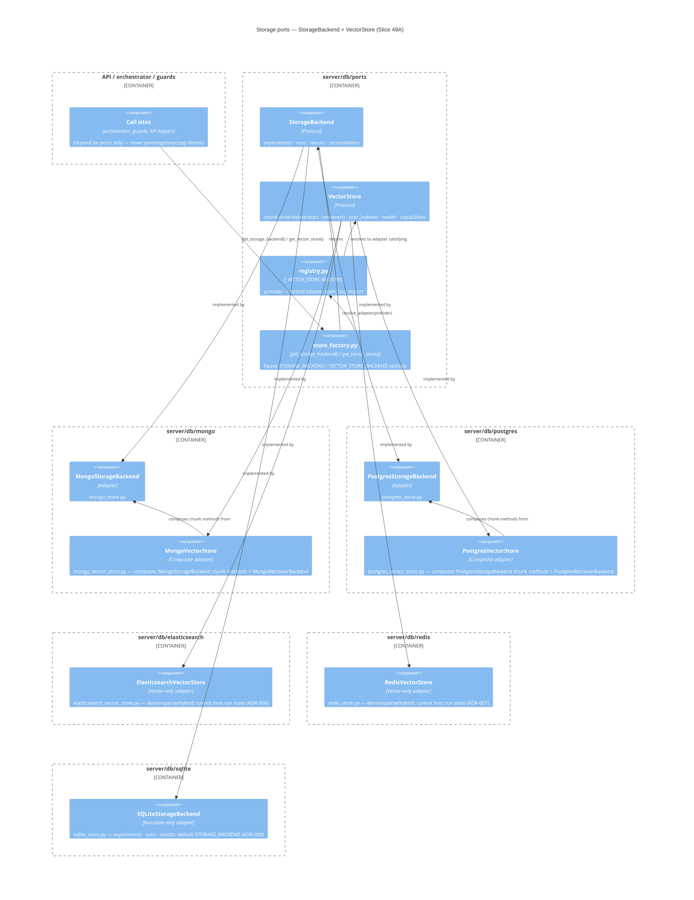
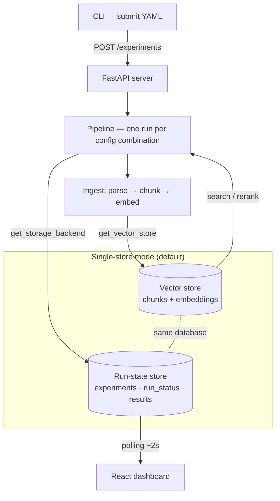

# Architecture


System design, data flow, module structure, and design decisions for `rag-params-finder`.

---

## 🏗️ System Overview

`rag-params-finder` is a **two-process system** for RAG parameter sweep experimentation:

1. **Python CLI** (thin client) — submits experiment configs to the server
2. **FastAPI Server** (engine) — orchestrates the full pipeline end-to-end
3. **React Dashboard** — visualization, sweep controls (pause/resume/cancel/delete), and results exploration

The CLI submits configs; the Dashboard observes progress and controls active sweeps. All pipeline business logic lives in the server.

> **Diagram convention:** **Mermaid is primary** for static structure (diagram-as-code — versioned, diff-able, dark-mode-safe), following C4 levels L1 (Context) → L2 (Container) → Key Flows (sequence). **ASCII art is retained as the always-portable fallback** — kept alongside each Mermaid diagram (in a collapsible block) for viewers where Mermaid can't render, and used on its own wherever Mermaid isn't available. Product/UI captures live in [`../images/`](../images/README.md); folder-theme view in [`module-theme-map.md`](module-theme-map.md).

---

## 🗺️ Context (C4 L1)



---

## 📦 Containers (C4 L2)



---

## 🔀 Data Flow



<details>
<summary>ASCII fallback (portable — renders anywhere)</summary>

```
CLI (submit YAML)
      │
      │  POST /experiments
      ▼
FastAPI Server
      │
      │  BackgroundTask per experiment
      ▼
┌──────────────────────────────────────────┐
│  Pipeline (one run per config combination)│
│                                          │
│  PDF/TXT/MD/CSV → Chunk → Embed          │
│       → vector write → Query → Rerank    │
│       → Store results                    │
└──────────────┬───────────────────────────┘
               │
               ▼
    Storage + vector store (SQLite / Mongo / pgvector / ES / Redis)
         ┌────────────┐
         │ chunks     │  ← embeddings + vector index
         │ experiments│
         │ run_status │  ← phase tracking
         │ results    │
         └────────────┘
               │
               │  polling (every 2s)
               ▼
       React Dashboard
```

</details>

---

## 🔁 Key flow — submit a sweep



---

## 🧭 End-to-end journey — pick a backend through a sweep

The sequence diagram above is deliberately backend-agnostic. This diagram fills the gap: it
follows one researcher from choosing a backend through running a sweep and troubleshooting it,
and shows exactly where that choice forks into two independent axes — **vector store**
(`VECTOR_STORE_BACKEND`) and **run-state store** (`STORAGE_BACKEND`) — per the pairing rule in
[`server/db/ports/registry.py`](../../server/db/ports/registry.py) (`_CAN_HOST_RUN_STATE`:
MongoDB/Postgres `True`, Elasticsearch/Redis `False`).



<details>
<summary>ASCII fallback (portable — renders anywhere)</summary>

```
Pick a vector store
   ├── MongoDB (cloud or local) ─────┐
   ├── Postgres / pgvector ──────────┤── can also host run state, or pair with a different store
   ├── Elasticsearch (vector only) ──┐
   └── Redis (vector only + cache) ──┤── must also pick a run-state store: Mongo / Postgres / SQLite (default)
                                      │
                                      ▼
                    Install deps + start stack (start-services.sh)
                                      │
                                      ▼
                       Configure .env (connection vars per guide)
                                      │
                                      ▼
                              Run a sweep — CLI
                                      │
         CLI: rag-params-finder run --config ...
                                      │
         FastAPI: POST /experiments (config_backend_guard + index preflight)
                                      │
                Pipeline: parse → chunk → embed
                                      │
              ┌───────────────────────┴───────────────────────┐
              ▼                                                ▼
   get_vector_store()                                get_storage_backend()
   → chosen vector-store lane                          → Mongo / Postgres / SQLite only
              └───────────────────────┬───────────────────────┘
                                      ▼
                     View results — Dashboard (poll GET /experiments/{id})
                                      │
                                      ▼
                  Troubleshoot (per-guide troubleshooting section)
```

See per-backend setup guides for detail: [mongodb-setup.md](../user-guide/mongodb-setup.md),
[postgres-setup.md](../user-guide/postgres-setup.md),
[elasticsearch-setup.md](../user-guide/elasticsearch-setup.md),
[redis-setup.md](../user-guide/redis-setup.md).

</details>

---

## 🎛️ Sweep-config axes — chunking, embedding, retrieval

The diagram above covers **infrastructure** choices (which vector store, which run-state store).
This one covers the **sweep-config** axes a researcher varies inside one experiment — chunking
method, embedding provider/model, retrieval method — plus two real "oddities" worth knowing
before you compose a sweep. Full reference tables live in
[`configuration.md`](../user-guide/configuration.md); this diagram shows how the axes relate.



<details>
<summary>ASCII fallback (portable — renders anywhere)</summary>

```
Chunking method            Embedding provider                  Retrieval method
┌────────────┐             ┌──────────────────────────┐        ┌─────────┐
│ fixed      │             │ local — all-MiniLM-L6-v2  │        │ dense   │
│ recursive  │   ⟷ compose │ voyage — voyage-4,        │ ⟷      │ sparse  │
│ token      │     freely  │   voyage-context-3, …     │ compose│ hybrid  │
│ sentence   │             │ sie [gated] — BGE-M3,     │ freely │         │
│ semantic ──┼─────┐       │   Stella-v5, SPLADE-v3    │        │         │
└────────────┘     │       │ doubleword [batch-only] — │        │    ▲    │
                    │       │   Qwen3-Embedding-8B      │        │    │    │
                    ▼       └──────────────┬────────────┘        │    │    │
          always loads local MiniLM        │                     sparse
          to score chunk boundaries,       │                     │
          regardless of provider above     │              ✗ NOT required —
                    │                      │              sparse is plain
                    ▼                      ▼              BM25/FTS on every
                 (local)                  (sie)            store, not SPLADE

Infrastructure axes (vector store / run-state / embedding cache) — see journey diagram above
```

**Two oddities worth knowing:**
- `chunking_method: semantic` always loads a local `all-MiniLM-L6-v2` model to score chunk
  boundaries, even when `embedding.provider` is `voyage`, `sie`, or `doubleword`
  ([`semantic.py:5-6,56-60`](../../server/core/chunkers/semantic.py)) — a hidden dependency the
  config schema doesn't surface.
- `retrieval.retrievers: [{type: sparse}]` does **not** require SIE or SPLADE — sparse retrieval
  is plain BM25/full-text search on every store (Mongo Atlas Search, Postgres `ts_rank_cd`,
  Elasticsearch BM25, Redis). SPLADE is a separate, optional sparse-vector *embedding* model, not
  a retrieval-method prerequisite.

See [`configuration.md`](../user-guide/configuration.md) for the full chunking/embedding/retrieval
reference tables, [`model_registry.py`](../../server/core/model_registry.py) for every registered
model, and [`sie_guard.py`](../../server/core/guards/sie_guard.py) for SIE's opt-in gating.

</details>

---

## 🧱 Technology Stack

### Backend (Server + CLI)

| Library | Purpose |
|---|---|
| FastAPI | REST API server |
| Python 3.12 | Language runtime |
| Voyage AI SDK | Embeddings + reranking (hosted) |
| sentence-transformers | Local embeddings + reranking (offline) |
| SIE (Superlinked Inference Engine) | Open-source embeddings via remote gateway or optional Docker (`sie_embedder.py`) |
| MongoDB Atlas / PyMongo | Vector storage + search (cloud or Atlas Local Docker) |
| LangChain text splitters | Recursive, fixed, token chunking |
| NLTK | Sentence chunking |
| tiktoken | Token-based chunking |
| pypdf | PDF text extraction |
| Typer | CLI framework |
| Rich | CLI output formatting |
| pydantic-settings | Centralized settings from `.env` |

### Frontend (Dashboard)

| Library | Purpose |
|---|---|
| React 19 | UI framework |
| TypeScript 5.8 | Type safety |
| Vite 6 | Build tool |
| Tailwind CSS | Styling (locally installed, not CDN) |

---

## 📁 Module Map

Theme tags (Behavior | Feature | Function) and folder layout status: [`module-theme-map.md`](module-theme-map.md). Slice 45 hotspots 1–5 **IMPLEMENTED** (incl. `scripts/{ci,docker,release,security}/`; flat shims for one minor) — [`SLICE-45-MODULE-THEME-SEPARATION.md`](../plan/slices/07-quality-craft/SLICE-45-MODULE-THEME-SEPARATION.md).

```
rag-params-finder/
├── server/
│   ├── main.py              # FastAPI app entry; lifespan: indexes + orphan reconciliation
│   ├── settings.py          # Centralized pydantic-settings config
│   ├── api/
│   │   ├── experiments.py   # CRUD, explore, db-stats, pause, resume, cancel, delete (façade)
│   │   ├── experiments_lifecycle.py  # Bayesian/stale-status helpers (Slice 45)
│   │   ├── experiments_shared.py  # StorageBackend helpers (threadpool I/O) incl. db-stats
│   │   ├── sweep.py         # POST /api/v1/sweep; GET /api/v1/best-config (persisted sweep history)
│   │   └── runs.py          # GET /runs/{id}/status
│   ├── core/
│   │   ├── pipeline/        # orchestrator, executors, experiment_control, search, signatures, …
│   │   ├── embedding/       # voyage/local/SIE embedders + factory + rate_limiter
│   │   ├── rerank/          # voyage + local CrossEncoder
│   │   ├── retrieval/       # retriever_mongo, retriever_postgres
│   │   ├── guards/          # search_index_*, sie_guard, config_backend_guard, health_check
│   │   ├── chunkers/        # fixed / recursive / token / sentence / semantic
│   │   ├── data_loader.py   # ingest (keep-at-core)
│   │   ├── query_loader.py  # queries file/URL loader (keep-at-core)
│   │   ├── model_registry.py
│   │   ├── results_analyzer.py
│   │   ├── aim_logger.py
│   │   └── atlas_storage.py
│   ├── models/              # Pydantic schemas and enums
│   ├── utils/
│   └── db/
│       ├── ports/           # StorageBackend, RetrieverBackend, store_factory, stats_common
│       ├── mongo/           # Atlas / local Mongo adapters + indexes
│       └── postgres/        # pgvector adapters + schema.sql
├── cli/
│   ├── main.py              # Typer app (façade)
│   ├── display.py           # watch/summary presentation (Slice 45)
│   ├── indexes_cmd.py
│   ├── config_loader.py
│   └── api_client.py
├── tests/
│   ├── server/              # mirrored unit suites (core/db/api/models)
│   ├── cli/
│   ├── scripts/
│   ├── contract/
│   ├── helpers/
│   └── conftest.py
├── scripts/
│   ├── ci/                  # quality-gates, repo-lint, hooks, pip-audit, floors
│   ├── docker/              # health-check, aim-ui, cleanup, wait-experiment
│   ├── release/             # release.sh + bump / GitHub helpers
│   ├── security/            # security-scan
│   └── lib/                 # shared compose helpers
└── frontend/src/
    ├── App.tsx
    ├── components/
    │   ├── screens/         # Experiments, Detail, SearchExplorer (+ tests)
    │   ├── chrome/          # shell, pagination, polling, loading, collapsible
    │   ├── experiment/      # controls, progress, delete modal, detail chrome
    │   ├── explore/         # Search Explorer panels
    │   └── stats/           # vector DB stats + StatTile/Row
    ├── hooks/
    │   └── useExperimentDetail.ts
    ├── test/helpers/        # shared Vitest builders
    ├── services/
    │   ├── apiClient.ts
    │   └── fetchWithProgress.ts
    ├── utils/
    └── types/index.ts
```

---

## ⚙️ Pipeline Phases

Each run progresses through phases tracked in the `run_status` collection:

| Phase | What happens |
|---|---|
| `QUEUED` | Run created, waiting to start |
| `PARSING` | Source files (PDF/TXT/MD/CSV) → plain text |
| `CHUNKING` | Text → chunks (per the configured method and params) |
| `EMBEDDING` | Chunks → embedding vectors (Voyage API, local model, or SIE gateway) |
| `STORING` | Write chunks + embeddings to MongoDB |
| `QUERYING` | Execute all test queries against the vector index |
| `RERANKING` | Cross-encoder reranks top-K initial results to top-K final |
| `COMPLETE` / `FAILED` / `INTERRUPTED` | Terminal state |

---

## 🤖 Provider System

Three embedding providers routed via `embedder_factory.get_embedder(provider)` — the orchestrator never branches on provider directly.

**Embedding provider** (`embedding.provider`):
- `local` → `server/core/embedding/local_embedder.py` → sentence-transformers `all-MiniLM-L6-v2` (384-dim)
- `voyage` → `server/core/embedding/embedder.py` → Voyage AI API (1024-dim); `voyage-context-3` uses `contextualized_embed()` with per-document segment splitting (32K-token window)
- `sie` → `server/core/embedding/sie_embedder.py` → BGE-M3, Stella-v5 (1024-dim dense), SPLADE-v3 (30522-dim sparse); preflight via `server/core/guards/sie_guard.py`; see [SIE setup](../user-guide/sie-setup.md)
- Dispatch: `server/core/embedding/embedder_factory.py` — orchestrator never branches on provider

**Retrieval configuration** (`retrieval.retrievers`):
- List of retriever types to sweep — each entry becomes one run (never combined)
- Traditional: `{type: dense|sparse|hybrid}` — no provider/model needed
- Rerankers: `{type: reranker|cross_encoder, provider: local|voyage, model: ...}`
  - `provider: local` → `server/core/rerank/local_reranker.py` → CrossEncoder `cross-encoder/ms-marco-MiniLM-L-6-v2`
  - `provider: voyage` → `server/core/rerank/reranker.py` → Voyage AI rerank API
  - Reranker runs fetch dense candidates internally before reranking
- Old format (`methods` + `retrieval_provider`/`retrieval_model`) auto-migrates to `retrievers` via Pydantic validator

Provider flows explicitly through `RunParams` → `orchestrator` → `embedder_factory` → embedder/reranker. The `model_registry.py` validates that model names match the declared provider at config load time.

**Tier 1 sweep API**: `POST /api/v1/sweep` accepts a ranked sweep request (caller supplies corpus list); `GET /health` includes `sie` and `version` fields when SIE is configured.

---

## 🧩 Storage Ports (C4 Component)

Two ports split run state from vector data (Slice 49A, DECISIONS #240): `StorageBackend`
owns experiments/runs/results CRUD + boot reconciliation; `VectorStore` owns chunk
write/delete/stats, search (via `retriever()`), index planning, health, and declared
`capabilities()`. A provider→adapter registry resolves the active vector store, so a
new store is one registry entry (`server/db/ports/registry.py`), not a branch in the
factory. Both `mongodb` and `postgres` can host run state, so pairing rule (ii) keeps
`VECTOR_STORE_BACKEND` equal to `STORAGE_BACKEND` for those two. A vector-only
store may differ. `elasticsearch` is registered and cannot host run state
(Slice 50). Slice 51 adds the local compose profile, `stores.tsv`, `GET /api/stores`,
and [ADR-006](../adr/ADR-006-elasticsearch-vector-store.md).



`get_retriever_backend()` keeps its existing name and signature — it now delegates to
`get_vector_store().retriever()` rather than branching on the backend string directly.
Guards (`health_check.py`, `search_index_guard.py`, `config_backend_guard.py`) compare
*resolved adapter classes* via the registry instead of `== "mongodb"` / `== "postgres"`
string literals, so the same seam that adds a store also removes the last of that
branching (an AST guard test enforces this — no store-string comparison outside
adapters/registry/settings/config).

---

## 🔀 Split-store data flow (Slice 49B)

Every chunk operation (write, delete, stats, search, index planning, health) now
routes through `get_vector_store()`; every run-state operation (experiments, runs,
results, boot reconciliation) routes through `get_storage_backend()`. In
**single-store mode** (`VECTOR_STORE_BACKEND` unset or equal to `STORAGE_BACKEND`)
both ports resolve to the same adapter, so the two lanes below collapse onto one
database — behaviour is byte-identical to pre-49B. In **split-store mode**
(`VECTOR_STORE_BACKEND` set to a vector-only store such as `elasticsearch`) the two
lanes hit different databases, governed by pairing rule (ii): a store that can
host run state must equal `STORAGE_BACKEND`; a vector-only store may pair with
either run-state store.



<details>
<summary>ASCII fallback (portable — renders anywhere)</summary>

```
CLI (submit YAML)
      │  POST /experiments
      ▼
FastAPI Server → Pipeline (one run per config combination)
      │
      ├── Ingest: parse → chunk → embed
      │        │
      │        ▼
      │   get_vector_store()  ──────────►  Vector store
      │        │                           (chunks + embeddings)
      │        ◄── search / rerank ────────────┘
      │
      └── Run metadata: experiments / run_status / results
               │
               ▼
        get_storage_backend()  ─────────►  Run-state store
               │                           (experiments · run_status · results)
               ▼
        React dashboard (polling)

Single-store mode: Vector store == Run-state store (same database).
Split-store mode:  Vector store != Run-state store (pairing rule (ii) governs
                    which combinations are valid — see Storage Ports above).
```

</details>

**Delete order** (DECISIONS #246): vector store first (chunks), then run state
(experiment, runs, results) — both steps idempotent, so a retry after a partial
failure completes the delete and reports true counts.

**Health / preflight**: `/healthz` probes both stores independently
(`vector_store_backend`, `run_state_mode`, `stores: {vector, run_state}`; a
`*-local` probe also includes `container` and `image` — see
[CLI Reference → `/healthz`](../user-guide/cli-reference.md)); `preflight_stores()`
checks the vector store first (health → index plan → capabilities, HTTP 422 on
failure) and only probes the run-state store's health when it differs from the
vector store.

---

## 🗄️ MongoDB Backend

Two deployment modes share identical query syntax (`$vectorSearch`, `$search`):

| Mode | URI pattern | Index provisioning |
|------|-------------|-------------------|
| **Atlas cloud** | `mongodb+srv://...` | Manual in Atlas UI on M0/M2/M5; server preflights on submit |
| **Atlas Local (Docker)** | `mongodb://localhost:27017/...?directConnection=true` | `bootstrap_indexes()` on server boot — no UI steps |

Detection: `server/db/mongo/mongodb_uri.py` (`is_atlas_uri`). TLS enabled only for cloud URIs (`server/db/mongo/atlas.py`). Docker: `./start-services.sh --mongodb-local` or `RAG_MONGODB_LOCAL=1`. See [MongoDB Setup](../user-guide/mongodb-setup.md).

---

## 🗄️ Postgres / pgvector Backend

`STORAGE_BACKEND=postgres` selects the Postgres adapters (`postgres_store.py`,
`retriever_postgres.py`). **SQLite is the default run-state backend** (`STORAGE_BACKEND=sqlite`, ADR-008);
`mongodb` and `postgres` remain fully supported non-default choices (legacy alias `mongo` normalizes
to `mongodb`). Postgres offers two deployments: local Docker
(`./start-services.sh --postgres-local`) or **Supabase-hosted Postgres** (same adapter;
cloud `POSTGRES_CLOUD_URL` / `POSTGRES_LOCAL_URL`). Example YAMLs live under `configs/supabase/` — that folder
name is not a second storage backend. Schema:
[`server/db/postgres/schema.sql`](../../server/db/postgres/schema.sql).
Operator setup: [Postgres Setup](../user-guide/postgres-setup.md).

### Dense retrieval — HNSW and `iterative_scan`

Dense search ranks by cosine similarity using pgvector’s `<=>` operator against
HNSW indexes on `embedding_384` and `embedding_1024`. Scores are reported on
**Atlas’s scale**, `(1 + cosine) / 2`, so an identical vector scores `1.0` and an
orthogonal one `0.5`. pgvector returns cosine *distance*; the query converts with
`1 - distance / 2`.

An HNSW index cannot apply a `WHERE` clause inside itself. Mandatory filters
(`experiment_id` / `embedding_model` / `run_id`) therefore run *after* the index
returns candidates, and anything filtered out is lost from the top-k. Measured on
a 2 472-chunk table with the planner forced onto HNSW, a query asking for 20 rows
came back with **3**.

Every pooled connection therefore sets `hnsw.iterative_scan = strict_order`
(pgvector ≥ 0.8), which keeps re-scanning until the limit is satisfied, in exact
distance order. On an older pgvector the server logs a warning and Postgres falls
back to an exact non-index scan — slower, but never short. A truncated result set
changes sweep scores without a visible error — upgrade pgvector if that warning
appears.

---

## 🗄️ MongoDB Collections

| Collection | Purpose | Key Indexes |
|---|---|---|
| `chunks` | Text chunks + embeddings | Vector index on `embedding` (384 or 1024-dim cosine) + filter fields |
| `experiments` | Experiment metadata + sweep config | `created_at`, `status` |
| `run_status` | Per-run phase tracking | `experiment_id`, `phase` |
| `results` | Per-query top-K results | `experiment_id`, `query_id` |

**Critical**: always filter vector search by `embedding_model` — vectors from different models have incompatible geometry and must never be mixed in the same search.

---

## 📐 Design Decisions

See `docs/adr/` for Architecture Decision Records:

- [ADR-001](../adr/ADR-001-two-process-architecture.md): Why CLI + Server (two-process architecture)
- [ADR-002](../adr/ADR-002-voyage-and-local-providers.md): Why dual embedding/reranking providers
- [ADR-003](../adr/ADR-003-mongodb-atlas-vector-store.md): MongoDB Atlas as original sole vector store (**Superseded**)
- [ADR-004](../adr/ADR-004-postgresql-pgvector-vector-store.md): Dual-backend Postgres/pgvector (Supabase) **and** MongoDB — run-state default later changed to SQLite by [ADR-008](../adr/ADR-008-sqlite-central-run-state-store.md)
- [ADR-005](../adr/ADR-005-doubleword-embedding-provider.md): DoubleWord batch-first embedding provider (**Proposed** — Slice 48, not yet implemented)

**Key design choices not covered by ADRs**:

| Decision | Rationale |
|---|---|
| FastAPI `BackgroundTasks` (not Celery) | No queue infrastructure needed while sweep runs execute with bounded in-process concurrency *(see [`SLICE-16`](../plan/slices/01-core-pipeline/SLICE-16-PARALLEL-SWEEP-RUNS.md) for hardening path)* |
| Hand-mirrored TypeScript types | No codegen tooling (typeshare/quicktype); 5 types + 3 enums is manageable manually |
| Separate vector indexes per dimension | Atlas requires exact `numDimensions` — `vector_index_1024` (Voyage) and `vector_index_384` (local) coexist on the same collection |
| Lazy-load + cache for local models | First run downloads from HuggingFace; subsequent runs instant — avoids blocking server startup |
| `numpy>=2` + `torch>=2.6` override | `sie-sdk` requires NumPy 2.x; older torch (2.2.x) was NumPy 1.x ABI and raised `Numpy is not available` |
| Shared `DashboardShell` + `AppPageChrome` components | Unified header, navigation, and page layout across all screens — consistent UX, easier maintenance |
| `fetchWithProgress` for streamed downloads | ReadableStream byte-level progress → visible loading bars; better UX than spinner for large payloads |
| Pagination on all screens | Prevents DOM overload and cognitive fatigue; default 10 items per page (experiments/runs), 5 per page (configs) |
| Dual loading indicators (panel + polling badge) | Initial load → full progress panel; background polls → subtle "Syncing..." badge; clear state transitions |
| Two progress patterns (network vs experiment) | `LoadingFeedbackPanel` for network/API loads (byte-level); `ExperimentProgressCard` for experiment execution (run completion); distinct concerns, reusable components |
| Cascade delete with confirmation | DELETE endpoint scrubs all collections (experiments, run_status, chunks, results); `ConfirmDeleteModal` shows experiment details + deletion statistics; prevents deletion of running experiments |
| Boot orphan reconciliation | `BackgroundTasks` sweeps die on process exit; startup marks in-flight runs `interrupted` and sets terminal experiment status — separate from Slice 10 retry |
| Pause / resume sweeps | Cooperative halt via `_SweepControl` threading events; `resume_sweep()` skips completed parameter signatures; status `paused` is non-terminal |
| Vector DB stats API + dashboard | `GET /experiments/vector-db-stats` (list: capacity, indexes, optional Atlas quota via `resolve_tier_specs()`) and `/{id}/db-stats` (detail: that experiment’s chunks, models, chunking, per-run counts). Store runtime on the list reads `GET /healthz` |
| Timezone-aware UTC timestamps | PyMongo `tz_aware=True`; all writes use `datetime.now(timezone.utc)` so JSON includes `Z` and browser elapsed/duration math is correct |
| `started_at` on first run | Duration and ETA exclude queue time between submission and first pipeline phase |
| Search index preflight | `required_search_indexes(config)` + cluster snapshot; fail before runs if missing/quota exhausted; HTTP 422 on submit |
| Postgres index preflight | Same 422 contract via catalog introspection (`pg_extension`, `pg_indexes`) — no Atlas Admin API, no quota/reconcile step; indexes come from `schema.sql` at pool bootstrap |
| `storage_mode` | Run state stays four values via `resolve_storage_mode()`: `mongodb-local` \| `mongodb-cloud` \| `postgres-local` \| `postgres-cloud`. The vector store's `storage_mode()` also emits `elasticsearch-local` \| `elasticsearch-cloud`. `/healthz` `storage_mode` is the vector mode |
| Index CLI | `indexes list` is backend-aware (Atlas quota view or Postgres catalog view); `indexes reset` stays Atlas-only — Postgres remediation is a schema-bootstrap restart |
| Option A scoped logging | `[rag-params-finder] [Scope] operation — details` in server (`scope_log.py`) and dashboard dev console (`devLog.ts`) |
| Dedicated thread pools (`executors.py`) | Sweeps and heavy Mongo aggregations no longer compete with lightweight `GET /experiments` on the default executor |
| Batched vector-db-stats queries | Three aggregation pipelines replace per-experiment N+1 round-trips on the experiments list |
| Decoupled dashboard polling | List 2 s / vector DB stats 60 s / Search Explorer 15 s while running — each with appropriate fetch timeouts in `frontend/src/constants.ts` |
| Search Explorer poll indicator timing | `PollingIndicator` showDelay + minVisibleMs reduce badge flicker on 15 s explore polls |

---

## Local deployment

| Mode | Command | Notes |
|------|---------|-------|
| Manual (default dev) | `uvicorn` + `npm run dev` | Two terminals; hot reload |
| Docker (prod profile) | `./start-services.sh` | Server + dashboard containers; Atlas cloud from `.env` when `STORAGE_BACKEND=mongodb` |
| Docker + Atlas Local | `./start-services.sh --mongodb-local` | Adds `mongodb/mongodb-atlas-local:8.3.3` container; auto-provisions search indexes |
| Docker + local Postgres | `./start-services.sh --postgres-local` | Adds `pgvector/pgvector:0.8.5-pg16` (Supabase stand-in); host port **5433** |
| Docker + hosted Supabase | `./start-services.sh --postgres-cloud` | No local DB container; requires `POSTGRES_CLOUD_URL` / `POSTGRES_LOCAL_URL` or `POSTGRES_CLOUD_URL` |
| Docker + local Elasticsearch | `./start-services.sh --elasticsearch-local` | Vector-only Elasticsearch 9.5.0; run state defaults to local MongoDB unless `STORAGE_BACKEND=postgres` |
| DB container only | `./start-services.sh mongodb\|postgres\|elasticsearch start\|stop\|reset\|status` | Native server/frontend on host |
| Docker (dev overlay) | `docker compose -f docker-compose.yml -f docker-compose.dev.yml up --build` | Bind mounts + HMR |

Atlas, Postgres, and Elasticsearch connection settings live in `.env` on the host (mounted into the server container). See [SLICE-14-DOCKER-COMPOSE.md](../plan/slices/03-platform/SLICE-14-DOCKER-COMPOSE.md), [MongoDB Setup](../user-guide/mongodb-setup.md), [Postgres Setup](../user-guide/postgres-setup.md), and [Elasticsearch Setup](../user-guide/elasticsearch-setup.md).

---

## 🔮 Future Enhancements

| Enhancement | Notes |
|---|---|
| Run recovery (retry failed / interrupted runs) | **Reconciliation on boot** ✅ — status fix only. **Retry** planned as [Slice 10](../plan/slices/01-core-pipeline/SLICE-10-RUN-RECOVERY.md): `recover` CLI + API; **`RECOVER_ON_BOOT`** = retry **INTERRUPTED** only |
| SSE live updates | Replace 2-second polling with Server-Sent Events |
| Parallel sweep (`execution.parallelism` > 1) | Implemented in [Slice 16 — Parallel Sweep Runs](../plan/slices/01-core-pipeline/SLICE-16-PARALLEL-SWEEP-RUNS.md) with a bounded in-process pool; **Celery + Redis** remains optional for future scale/fairness needs |
| Dashboard-triggered runs | Submit experiments from the React UI, not just CLI |
| Experiment cleanup CLI | `rag-params-finder cleanup --older-than 30d` |

---

## 👉 See Also

- [Extending the System](extending.md) — add new models, chunkers, or endpoints
- [Development Guide](development.md) — dev loop, quality gates, slice playbook
- [ADR-001](../adr/ADR-001-two-process-architecture.md) · [ADR-002](../adr/ADR-002-voyage-and-local-providers.md) · [ADR-003](../adr/ADR-003-mongodb-atlas-vector-store.md) · [ADR-004](../adr/ADR-004-postgresql-pgvector-vector-store.md) · [ADR-005](../adr/ADR-005-doubleword-embedding-provider.md) (Proposed) — detailed rationale for key decisions
