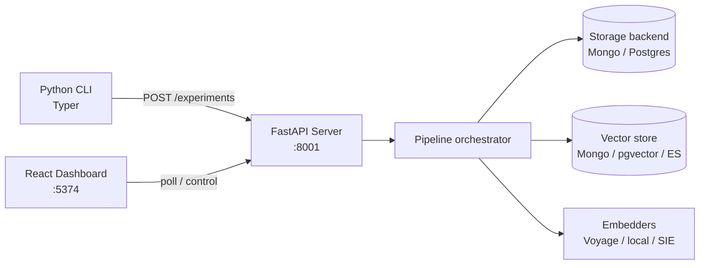

# Architecture Growth Log

Rolling, **append-only** record of how the architecture evolves, one entry per slice close.
The seed **Baseline** below is the collective L1 of all completed slices; past slices are **not**
retrofitted. Each new Must/Should slice appends a `### <date> — Slice NN: <name>` **Delta** at close
(see [`slices/README.md`](slices/README.md) § Abstraction Views).

Canonical, always-current architecture: [`../contributor-guide/architecture.md`](../contributor-guide/architecture.md)
and [`../contributor-guide/module-theme-map.md`](../contributor-guide/module-theme-map.md). This log is the
*history of change*, not a second SSOT.

---

### 2026-09-26 — Baseline (seed)

**L1 — Context** (system in one diagram)

Text fallback: **CLI** submits YAML configs to the **FastAPI server**; the **dashboard** observes and
controls sweeps. The server runs a **pipeline** that talks to a **storage backend** (run state) and a
**vector store** (chunks) through Protocol ports, and to pluggable **embedders**.

**L2 — Process** (pipeline phases + ports)

- Phases: `QUEUED → PARSING → CHUNKING → EMBEDDING → STORING → QUERYING → RERANKING → COMPLETE`.
- Ports (SSOT): `StorageBackend` (experiment/run/chunk/result CRUD + cascade) and `RetrieverBackend`
  (dense/sparse/hybrid) resolved via `server/db/ports/store_factory.py`.
- Split-store: `get_storage_backend()` (run state) vs `get_vector_store()` (chunks); `get_retriever_backend()`
  resolves via the vector store. `VECTOR_STORE_BACKEND` defaults to `STORAGE_BACKEND`.
- Provider dispatch: `server/core/embedding/embedder_factory.py` (Voyage / local / SIE; DoubleWord proposed).

**Data-Flow**: `CLI → POST /experiments → BackgroundTask per experiment → per-config run
(parse → chunk → embed → vector write → query → rerank → store results) → stores → dashboard polling`.

**Established invariants at seed**: dual-backend additive (Mongo default permanent, #130); mandatory
`embedding_model` + `experiment_id` + `run_id` filter on vector queries; single-worker `SWEEP_EXECUTOR`.
Full list: [`invariants.md`](invariants.md).

---

<!-- Append new slice deltas below this line, newest last. Template:

### <YYYY-MM-DD> — Slice NN: <name>
- **Delta**: what structurally changed (new module / port / phase / data path).
- **L1/L2 impact**: which box or edge above moved; link the slice's Abstraction Views.
- **Data-Flow**: only if the data path changed.
-->
