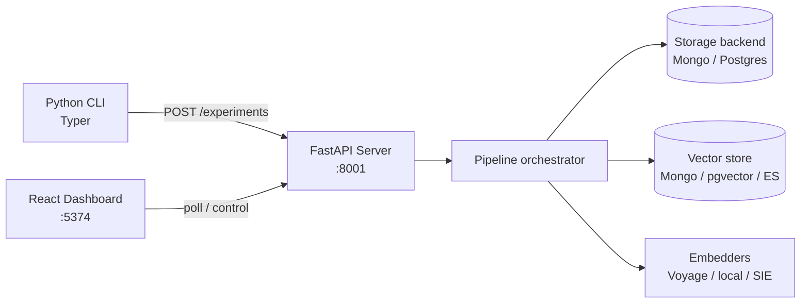

# Architecture Growth Log

Rolling, **append-only** record of how the architecture evolves, one entry per slice close.
The seed **Baseline** below is the collective L1 of all completed slices; past slices are **not**
retrofitted. Each new Must/Should slice appends a `### <date> — Slice NN: <name>` **Delta** at close
(see [`slices/README.md`](slices/README.md) § Abstraction Views).

Canonical, always-current architecture: [`../contributor-guide/architecture.md`](../contributor-guide/architecture.md)
and [`../contributor-guide/module-theme-map.md`](../contributor-guide/module-theme-map.md). This log is the
*history of change*, not a second SSOT.

---

### 2026-09-26 — Baseline (seed)

**L1 — Context** (system in one diagram)

```mermaid
flowchart LR
  CLI[Python CLI<br/>Typer] -->|POST /experiments| SRV[FastAPI Server<br/>:8001]
  DASH[React Dashboard<br/>:5374] -->|poll / control| SRV
  SRV --> PIPE[Pipeline orchestrator]
  PIPE --> STORE[(Storage backend<br/>Mongo / Postgres)]
  PIPE --> VEC[(Vector store<br/>Mongo / pgvector / ES)]
  PIPE --> EMB[Embedders<br/>Voyage / local / SIE]
```

Text fallback: **CLI** submits YAML configs to the **FastAPI server**; the **dashboard** observes and
controls sweeps. The server runs a **pipeline** that talks to a **storage backend** (run state) and a
**vector store** (chunks) through Protocol ports, and to pluggable **embedders**.

**L2 — Process** (pipeline phases + ports)

- Phases: `QUEUED → PARSING → CHUNKING → EMBEDDING → STORING → QUERYING → RERANKING → COMPLETE`.
- Ports (SSOT): `StorageBackend` (experiment/run/chunk/result CRUD + cascade) and `RetrieverBackend`
  (dense/sparse/hybrid) resolved via `server/db/ports/store_factory.py`.
- Split-store: `get_storage_backend()` (run state) vs `get_vector_store()` (chunks); `get_retriever_backend()`
  resolves via the vector store. `VECTOR_STORE_BACKEND` defaults to `STORAGE_BACKEND`.
- Provider dispatch: `server/core/embedding/embedder_factory.py` (Voyage / local / SIE; DoubleWord proposed).

**Data-Flow**: `CLI → POST /experiments → BackgroundTask per experiment → per-config run
(parse → chunk → embed → vector write → query → rerank → store results) → stores → dashboard polling`.

**Established invariants at seed**: dual-backend additive (Mongo default permanent, #130); mandatory
`embedding_model` + `experiment_id` + `run_id` filter on vector queries; single-worker `SWEEP_EXECUTOR`.
Full list: [`invariants.md`](invariants.md).

---

<!-- Append new slice deltas below this line, newest last. Template:

### <YYYY-MM-DD> — Slice NN: <name>
- **Delta**: what structurally changed (new module / port / phase / data path).
- **L1/L2 impact**: which box or edge above moved; link the slice's Abstraction Views.
- **Data-Flow**: only if the data path changed.
-->

### 2026-09-27 — Slice 50: Elasticsearch adapter core
- **Delta**: `server/db/elasticsearch/` is a vector-only registry adapter (`can_host_run_state=False`). One `{prefix}-chunks` index holds `embedding_384` and `embedding_1024` as explicit unquantized HNSW. Dense, sparse, and hybrid search share `rrf_fuse` with Mongo; Postgres still fuses in SQL.
- **L1/L2 impact**: the vector-store box now includes Elasticsearch beside Mongo and pgvector. Run state stays on Mongo or Postgres.
- **Data-Flow**: chunk write/search/delete for `VECTOR_STORE_BACKEND=elasticsearch` goes to Elasticsearch (`refresh=wait_for` on bulk, delete-by-query on delete). Experiment, run, and result rows stay on the run-state store.

### 2026-09-27 — Slice 51: Elasticsearch operability
- **Delta**: `scripts/lib/stores.tsv` is the operator manifest for start, stop, and health probes. `GET /api/stores` is the public catalog (labels, example config, index summary; secrets omitted). The server image takes optional `EXTRAS=elasticsearch`. Nightly live tests are one `vector-store-integration` matrix.
- **L1/L2 impact**: a fresh clone can start local Elasticsearch beside the existing Mongo and Postgres paths. The vector-store box is unchanged from Slice 50; the new edge is operator scripts and the catalog API.
- **Data-Flow**: unchanged from Slice 50. `--elasticsearch-local` pairs Elasticsearch vectors with Postgres run state unless `STORAGE_BACKEND` is already `mongodb`.

### 2026-09-28 — Slice 51: close
- **Delta**: Postgres sparse and hybrid OR the `websearch_to_tsquery` lexemes, matching Atlas Search and Elasticsearch `match` any-term behaviour. Atlas Local's healthcheck requires a writable primary, and the compose hostname is the replica-set name for the life of the volume. `--elasticsearch-local` pairs MongoDB run state unless `STORAGE_BACKEND=postgres`.
- **L1/L2 impact**: no new box. The Postgres retrieval edge now ranks partial question matches.
- **Data-Flow**: unchanged.

### 2026-09-30 — Slice 52: Redis evaluation spike
- **Delta**: Docs-only research (no product code). `docs/_internal/REDIS-EVALUATION.md` (6-stream research report: delta map, candidate free-gate verdicts, adoption metrics, PoC transcript, Branch B verdicts, weighted scoring). `docs/_internal/redis-evaluation.html` (self-contained interactive guide with live weight slider). `docs/adr/ADR-007-redis.md` (Proposed: Redis 8 or Valkey as vector-only store, mirrors ADR-006 shape). DECISIONS #272–#273 (GO/NO-GO stubs for Slices 53/54, PENDING owner decision).
- **L1/L2 impact**: no code box changed. ADR-007 Proposed marks the intent to add Redis as a fourth vector-store option beside Mongo, Postgres, and Elasticsearch. The zero-changes criterion is verified: adding Redis requires only one `DatabaseProvider` token and Docker infra — no routes, sweep logic, UI, or CLI changes.
- **Data-Flow**: no change. Slice 53 (Branch A GO) will add `VECTOR_STORE_BACKEND=redis` data path alongside the existing three. Branch B (embedding cache) remains Could pending Slice 54.

### 2026-09-30 — Slice 53: Redis vector-store adapter
- **Delta**: `server/db/redis/` (8-module package) added as the 4th vector-only `VectorStoreAdapter` behind the Slice 49 registry. Score convention `score = 1 − d/2` (COSINE distance → [0,1]). `redis-py` is a lazy-import optional extra (`.[redis]`). Preflight checks Query Engine presence (FT._LIST), eviction policy (`allkeys-*` → 422, `volatile-lru` → warning), AOF state (off → warning), and capacity. Vector keys carry TTL = -1 (never expire); `volatile-lru` therefore never evicts them without explicit misconfiguration. `redis-local` Docker Compose profile (Redis 8, AOF on, `--maxmemory 256mb volatile-lru`, bind `0.0.0.0 --protected-mode no`). `--redis-local` start-services flag pairs Redis vectors with `sqlite` run state by default (ADR-008; was `mongodb-local` pre-remediation). 9 example YAML configs. 151 unit tests via `sys.modules` injection (no live Redis required), 99.61% branch coverage. *Post-PASSED (`fix/redis-readiness-audit-remediation`): import path fix, `_is_not_found` precedence bug, 500-doc batching, `UNLINK`, `EF_RUNTIME`, sparse OR-tokenized query, pipelined HGET stats, `run_config_preflight()` via guard.*
- **L1/L2 impact**: the vector-store box now includes Redis beside Mongo, pgvector, and Elasticsearch. `DatabaseProvider` Literal widened to include `"redis"`. `can_host_run_state=False` enforced (D1 boundary: `STORAGE_BACKEND=redis` → 422). `nightly.yml` gains a fourth `vector-store-integration` matrix leg (redis:8). Operator script (`stores.tsv`) gains a redis row.
- **Data-Flow**: chunk write/search/delete for `VECTOR_STORE_BACKEND=redis` goes to Redis (`HSET` per chunk, `FT.SEARCH` for retrieval with client-side RRF hybrid, `UNLINK` for async non-blocking delete). Experiment, run, and result rows stay on the run-state store (MongoDB, Postgres, or SQLite).
