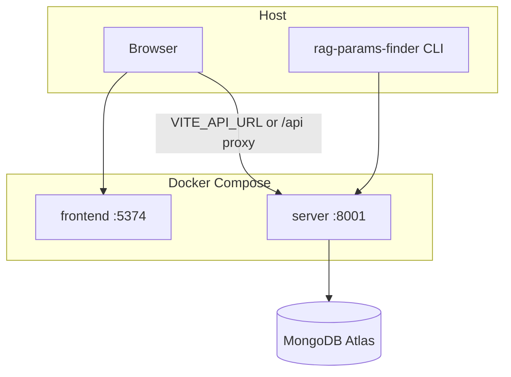

# SLICE 14 — Docker Compose (AIE7 patterns, Atlas-adapted)

**MoSCoW:** Should *(one-command local stack for judges and contributors)*
**Target time:** ~2–3 h
**Status:** ✅ COMPLETE
**Reference:** [neomatrix369/AIE7-Demo-Day-Project](https://github.com/neomatrix369/AIE7-Demo-Day-Project) (RagCheck Docker lifecycle)

---

## Goal

One command (`./start-services.sh`) starts the **FastAPI server** and **React dashboard** in Docker. MongoDB Atlas and secrets stay in `.env` on the host (not baked into images). The **CLI runs on the host** and talks to `http://localhost:8001` ([ADR-001](../adr/ADR-001-two-process-architecture.md)).

## Non-goals

- No Qdrant or local MongoDB container ([ADR-003](../adr/ADR-003-mongodb-atlas-vector-store.md))
- No Celery / Redis
- No in-container CLI by default
- Does not replace the manual `uvicorn` + `npm run dev` loop (still documented)

---

## MoSCoW

| Priority | Item |
|----------|------|
| **Must** | `docker compose up --build -d` (prod default); health-gated `server → frontend`; `scripts/health-check.sh`; `.dockerignore`; bind mounts `configs/`, `input_data/`; `hf_cache` volume; fail-fast shell (`set -e`, `set -o pipefail`) |
| **Should** | `stop-services.sh` (standard / quick pause / deep cleanup); `setup.sh` Docker-first router; `.env.example` Compose naming vars |
| **Could** | CI `docker compose build` job (build-only, no Atlas) |
| **Won't** | CLI container; local vector DB emulator |

---

## Architecture



**URL model (same as AIE7):**

| Caller | Target |
|--------|--------|
| Browser → API | `http://localhost:8001` (published port) |
| Dev frontend container → API | `http://server:8001` (Compose DNS) |
| Host CLI | `SERVER_URL=http://localhost:8001` |

**Profiles:**

| Profile | Frontend | Server |
|---------|----------|--------|
| *(default, prod)* | `vite preview` after `npm run build` | `uvicorn` without reload |
| `dev` (`docker-compose.dev.yml` or `RAG_DEV_STACK=1`) | `vite dev` + bind mounts, `/api` → `server:8001` | `uvicorn --reload` + bind mounts |

---

## Decisions

| Decision | Choice | Rationale |
|----------|--------|-----------|
| CLI location | Host only | ADR-001 two-process architecture |
| Default profile | Prod | Reliable demos; dev via `--profile dev` |
| Server install | `uv` in image | Parity with contributor docs |
| HF models | Named volume `hf_cache` | Avoid re-download on every rebuild |
| Health gate | `/healthz` includes MongoDB ping | “Up” means Atlas reachable, not just process alive |
| Non-interactive | `NONINTERACTIVE=1` | CI/scripts skip menus |

---

## Acceptance criteria

- [x] With valid `.env` and Atlas indexes ([mongodb-setup](../user-guide/mongodb-setup.md)), `./start-services.sh` exits 0 and prints :8001 and :5374 URLs
- [x] `curl -f http://localhost:8001/healthz` returns `{"ok": true, "mongodb": "ok"}`
- [x] `./scripts/health-check.sh` passes
- [x] Dashboard at `http://localhost:5374` loads; `GET /experiments` works
- [x] Host: `rag-params-finder run --config configs/example-mongodb-local.yaml --detach` submits against containerized server
- [x] `docker compose -f docker-compose.yml -f docker-compose.dev.yml up --build -d` serves HMR with `/api` proxy
- [x] `./stop-services.sh` option 1 stops stack without deleting Atlas data

---

## Files

| File | Purpose |
|------|---------|
| `docker-compose.yml` | `server` + `frontend` (prod default) |
| `docker-compose.dev.yml` | Dev overlay (HMR + reload) |
| `docker/server.Dockerfile` | Python 3.12 + uv + app |
| `docker/frontend.Dockerfile` | Node 22 multi-stage build + preview |
| `.dockerignore` | Fast builds |
| `start-services.sh` | Start + health check |
| `stop-services.sh` | Stop modes |
| `setup.sh` | Docker-first or `--manual` |
| `scripts/docker-cleanup.sh` | Shared prune helpers |
| `scripts/health-check.sh` | Smoke after start |

---

## Verification

```bash
cp .env.example .env   # real MONGODB_URI; Atlas indexes per mongodb-setup.md
./start-services.sh
./scripts/health-check.sh
rag-params-finder run --config configs/example-mongodb-local.yaml --detach
# Optional dev profile:
docker compose -f docker-compose.yml -f docker-compose.dev.yml up --build -d
./stop-services.sh
./scripts/quality-gates.sh
```

---

## Risks

| Risk | Mitigation |
|------|------------|
| Large server image (sentence-transformers) | `hf_cache` volume; document first-run download |
| Missing `input_data/` | Warn in start script; link mongodb-setup |
| Atlas IP allowlist | Document `0.0.0.0/0` for dev clusters |
| Frontend build needs devDependencies | Full `npm ci` in build stage |
